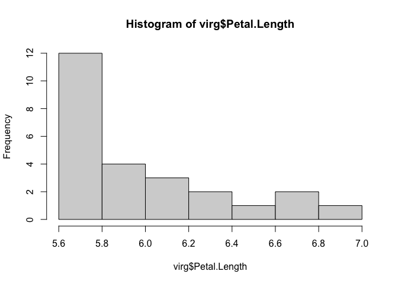
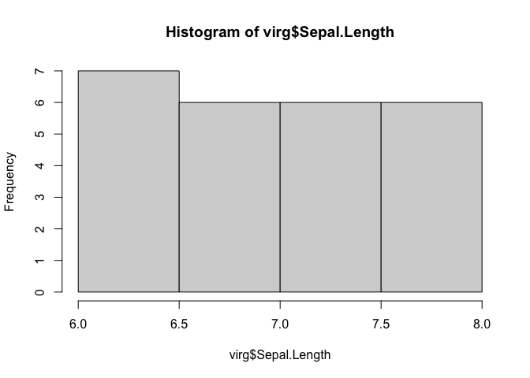
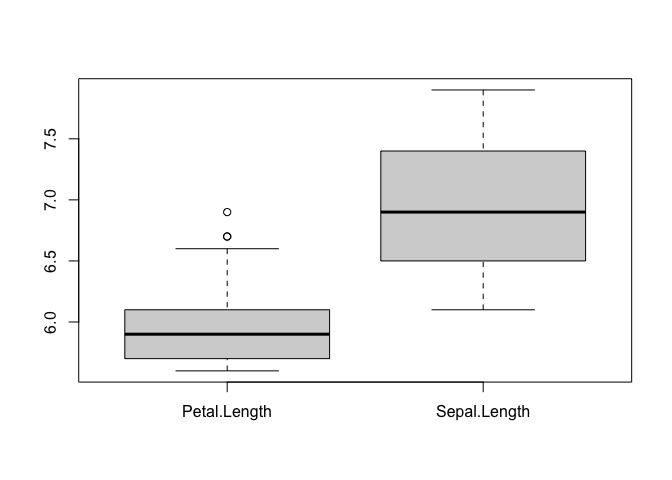

virginica
================
Peeraya Sanugul
2025-03-07

Enable dplyr software

``` r
library(dplyr)
```

    ## 
    ## Attaching package: 'dplyr'

    ## The following objects are masked from 'package:stats':
    ## 
    ##     filter, lag

    ## The following objects are masked from 'package:base':
    ## 
    ##     intersect, setdiff, setequal, union

Define the data frame (vir) by selecting only virginica species

``` r
vir = filter(iris, Species == "virginica")
vir
```

    ##    Sepal.Length Sepal.Width Petal.Length Petal.Width   Species
    ## 1           6.3         3.3          6.0         2.5 virginica
    ## 2           5.8         2.7          5.1         1.9 virginica
    ## 3           7.1         3.0          5.9         2.1 virginica
    ## 4           6.3         2.9          5.6         1.8 virginica
    ## 5           6.5         3.0          5.8         2.2 virginica
    ## 6           7.6         3.0          6.6         2.1 virginica
    ## 7           4.9         2.5          4.5         1.7 virginica
    ## 8           7.3         2.9          6.3         1.8 virginica
    ## 9           6.7         2.5          5.8         1.8 virginica
    ## 10          7.2         3.6          6.1         2.5 virginica
    ## 11          6.5         3.2          5.1         2.0 virginica
    ## 12          6.4         2.7          5.3         1.9 virginica
    ## 13          6.8         3.0          5.5         2.1 virginica
    ## 14          5.7         2.5          5.0         2.0 virginica
    ## 15          5.8         2.8          5.1         2.4 virginica
    ## 16          6.4         3.2          5.3         2.3 virginica
    ## 17          6.5         3.0          5.5         1.8 virginica
    ## 18          7.7         3.8          6.7         2.2 virginica
    ## 19          7.7         2.6          6.9         2.3 virginica
    ## 20          6.0         2.2          5.0         1.5 virginica
    ## 21          6.9         3.2          5.7         2.3 virginica
    ## 22          5.6         2.8          4.9         2.0 virginica
    ## 23          7.7         2.8          6.7         2.0 virginica
    ## 24          6.3         2.7          4.9         1.8 virginica
    ## 25          6.7         3.3          5.7         2.1 virginica
    ## 26          7.2         3.2          6.0         1.8 virginica
    ## 27          6.2         2.8          4.8         1.8 virginica
    ## 28          6.1         3.0          4.9         1.8 virginica
    ## 29          6.4         2.8          5.6         2.1 virginica
    ## 30          7.2         3.0          5.8         1.6 virginica
    ## 31          7.4         2.8          6.1         1.9 virginica
    ## 32          7.9         3.8          6.4         2.0 virginica
    ## 33          6.4         2.8          5.6         2.2 virginica
    ## 34          6.3         2.8          5.1         1.5 virginica
    ## 35          6.1         2.6          5.6         1.4 virginica
    ## 36          7.7         3.0          6.1         2.3 virginica
    ## 37          6.3         3.4          5.6         2.4 virginica
    ## 38          6.4         3.1          5.5         1.8 virginica
    ## 39          6.0         3.0          4.8         1.8 virginica
    ## 40          6.9         3.1          5.4         2.1 virginica
    ## 41          6.7         3.1          5.6         2.4 virginica
    ## 42          6.9         3.1          5.1         2.3 virginica
    ## 43          5.8         2.7          5.1         1.9 virginica
    ## 44          6.8         3.2          5.9         2.3 virginica
    ## 45          6.7         3.3          5.7         2.5 virginica
    ## 46          6.7         3.0          5.2         2.3 virginica
    ## 47          6.3         2.5          5.0         1.9 virginica
    ## 48          6.5         3.0          5.2         2.0 virginica
    ## 49          6.2         3.4          5.4         2.3 virginica
    ## 50          5.9         3.0          5.1         1.8 virginica

Find a summary of data frame : focus on the mean of petal length

``` r
summary(vir)
```

    ##   Sepal.Length    Sepal.Width     Petal.Length    Petal.Width   
    ##  Min.   :4.900   Min.   :2.200   Min.   :4.500   Min.   :1.400  
    ##  1st Qu.:6.225   1st Qu.:2.800   1st Qu.:5.100   1st Qu.:1.800  
    ##  Median :6.500   Median :3.000   Median :5.550   Median :2.000  
    ##  Mean   :6.588   Mean   :2.974   Mean   :5.552   Mean   :2.026  
    ##  3rd Qu.:6.900   3rd Qu.:3.175   3rd Qu.:5.875   3rd Qu.:2.300  
    ##  Max.   :7.900   Max.   :3.800   Max.   :6.900   Max.   :2.500  
    ##        Species  
    ##  setosa    : 0  
    ##  versicolor: 0  
    ##  virginica :50  
    ##                 
    ##                 
    ## 

Define the data frame (virg) by selecting only the data of petal length
that is longer than mean

``` r
virg = filter(vir, Petal.Length >5.552)
virg
```

    ##    Sepal.Length Sepal.Width Petal.Length Petal.Width   Species
    ## 1           6.3         3.3          6.0         2.5 virginica
    ## 2           7.1         3.0          5.9         2.1 virginica
    ## 3           6.3         2.9          5.6         1.8 virginica
    ## 4           6.5         3.0          5.8         2.2 virginica
    ## 5           7.6         3.0          6.6         2.1 virginica
    ## 6           7.3         2.9          6.3         1.8 virginica
    ## 7           6.7         2.5          5.8         1.8 virginica
    ## 8           7.2         3.6          6.1         2.5 virginica
    ## 9           7.7         3.8          6.7         2.2 virginica
    ## 10          7.7         2.6          6.9         2.3 virginica
    ## 11          6.9         3.2          5.7         2.3 virginica
    ## 12          7.7         2.8          6.7         2.0 virginica
    ## 13          6.7         3.3          5.7         2.1 virginica
    ## 14          7.2         3.2          6.0         1.8 virginica
    ## 15          6.4         2.8          5.6         2.1 virginica
    ## 16          7.2         3.0          5.8         1.6 virginica
    ## 17          7.4         2.8          6.1         1.9 virginica
    ## 18          7.9         3.8          6.4         2.0 virginica
    ## 19          6.4         2.8          5.6         2.2 virginica
    ## 20          6.1         2.6          5.6         1.4 virginica
    ## 21          7.7         3.0          6.1         2.3 virginica
    ## 22          6.3         3.4          5.6         2.4 virginica
    ## 23          6.7         3.1          5.6         2.4 virginica
    ## 24          6.8         3.2          5.9         2.3 virginica
    ## 25          6.7         3.3          5.7         2.5 virginica

Create histogram of petal and sepal length

``` r
hist(virg$Petal.Length)
```

<!-- -->

``` r
hist(virg$Sepal.Length)
```

<!-- -->

Create box-plot of petal and sepal length

``` r
boxplot(virg[,c("Petal.Length","Sepal.Length")])
```

<!-- -->
